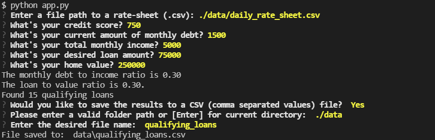
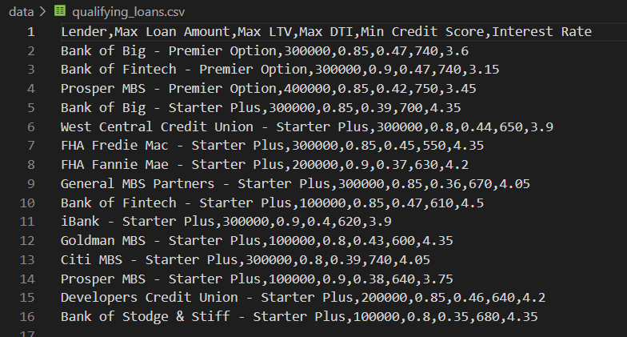

# Fintech Loan Qualifier Application

The Loan Qualifier Application is a Python command-line interface (CLI) application that allows users to see qualifying loans from lenders quickly and easily. The application works by accepting a `daily_rate_sheet` of loan criteria from various loan providers, asking the user a number of questions to evaluate their loan eligibility, and then returning to them a list of qualifying loans.

## Technologies

The application uses the following technologies:

- Python 3.7
- [Fire library](https://google.github.io/python-fire/guide/) for adding a command-line interface (CLI)
- [Questionary library](https://questionary.readthedocs.io/en/stable/) for enabling a user-friendly CLI

## Installation Guide

```python

pip install fire
pip install questionary

```

## Usage

### Startup

```python

python app.py

```

### Input Example



### Output Example



## Contributors

- Jacob Rougeau

[50 command terminal history](docs/terminal_history.txt)

[terminal git log](docs/commits.txt)

## License

MIT
